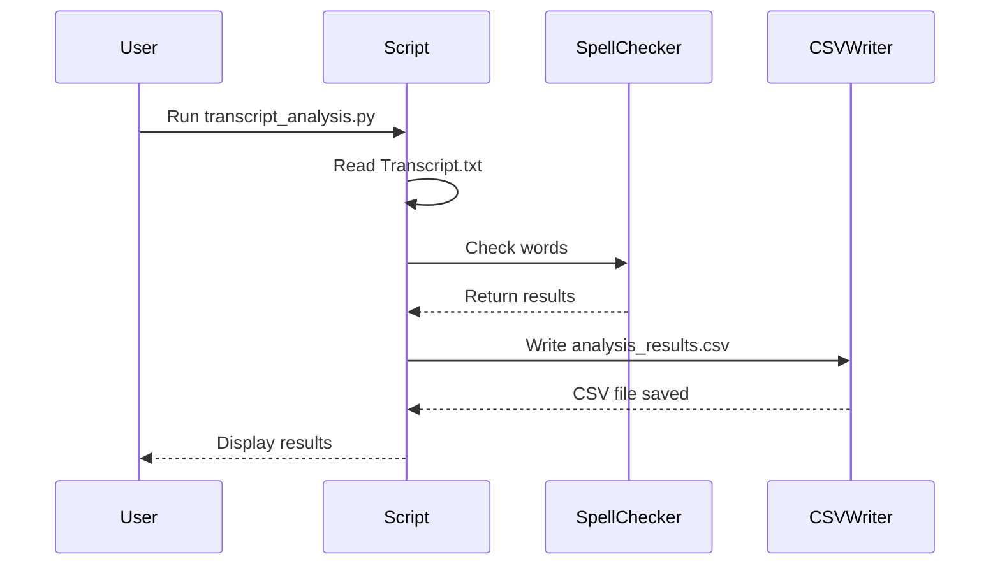

# Transcript Analysis Tool

This Python-based tool analyzes transcripts from `.txt` files, detects inaccurate words using a spell checker, calculates accuracy scores, and provides detailed analysis. It also generates a CSV file with the analysis results.

## Features

- Reads a transcript from `Transcript.txt`.
- Detects inaccurate words using the `pyspellchecker` library.
- Computes accurate and inaccurate word counts for each line.
- Provides a summary of the overall accuracy score and percentage.
- Saves detailed analysis and overall score to `analysis_results.csv`.

## Requirements

- Python 3.x
- `pyspellchecker` library

## Installation

1. Clone the repository:

   ```bash
   git clone https://github.com/yourusername/transcript-analysis.git
   cd transcript-analysis
   ```

2. Install the required Python libraries:

   ```bash
   pip install -r requirements.txt
   ```

   Or install `pyspellchecker` manually:

   ```bash
   pip install pyspellchecker
   ```

## Usage

1. Prepare your transcript in `Transcript.txt`. Each line should represent either a timestamp or a line of the transcript.

   Example format:

   ```
   34.9 --> 60.9 Student: Hi, how are you?
   54.7 --> 55.7 Tutor: Hello?
   55.7 --> 58.7 Tutor: I'm great, thank you.
   ```

2. Run the script:

   ```bash
   python transcript_analysis.py
   ```

   The tool will analyze the transcript and print the results to the console.

3. The results will also be saved to `analysis_results.csv`.

Example CSV output:

```
Timestamp,Transcript,Accurate Words,Inaccurate Words,Accuracy Score,Accuracy Percentage
34.9 --> 60.9,Student: Hi, how are you?,5,1,0.83,83.33
54.7 --> 55.7,Tutor: Hello?,1,0,1.0,100.0
55.7 --> 58.7,Tutor: I'm great, thank you.,5,0,1.0,100.0
Overall,,11,1,0.92,91.67
```

## How It Works

- **Text Processing**: Reads `Transcript.txt` and splits the text into timestamps and corresponding transcripts.
- **Inaccuracy Detection**: Uses `pyspellchecker` to identify and count inaccurate words.
- **Accuracy Calculation**: Computes the accuracy score for each line and an overall accuracy score for the entire transcript.
- **CSV Output**: Saves analysis results, including accurate and inaccurate word counts, in a CSV file.

## Sequence Diagram



## Error Handling

- Displays an error message and terminates if an error occurs while processing the transcript (e.g., invalid file format or reading issue).

## Author

Marlo Barua
